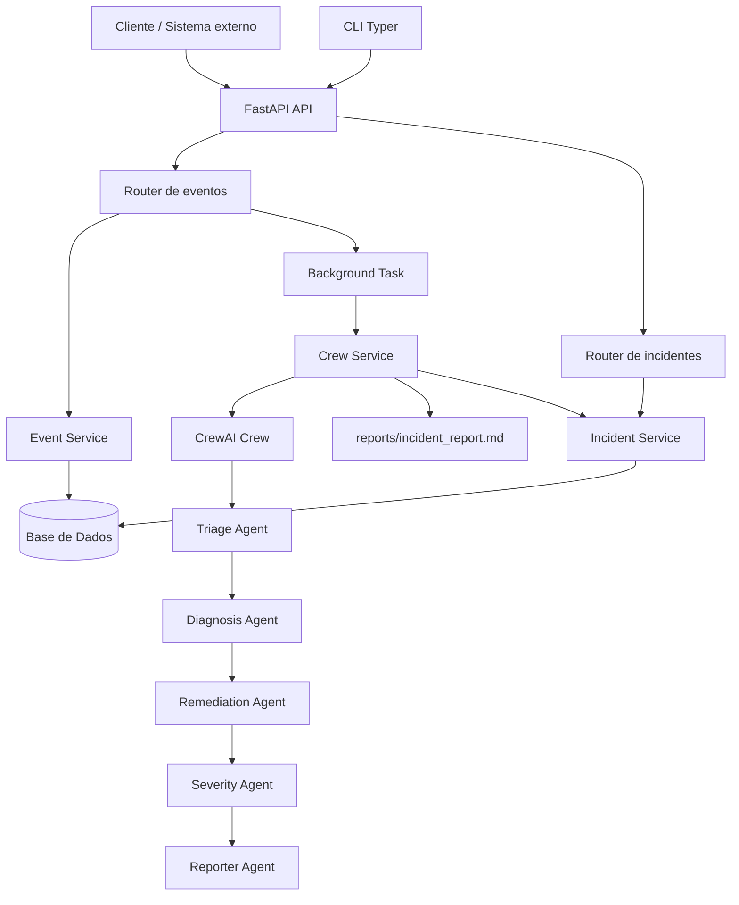
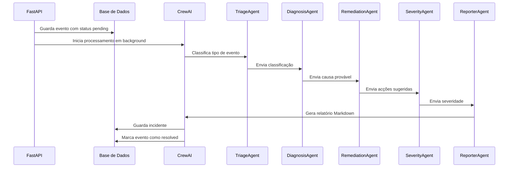
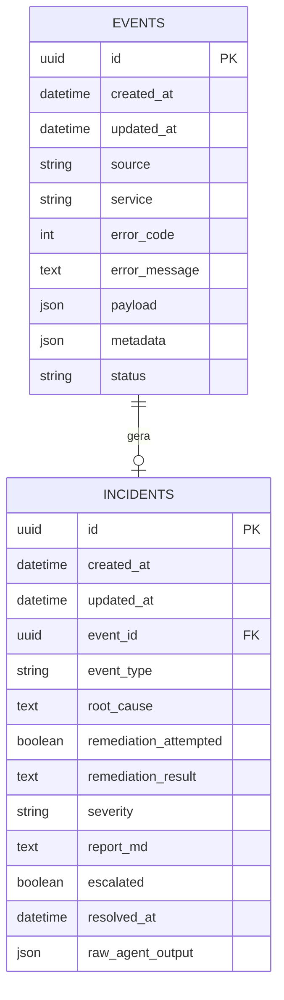

# Dead Letter Office

[](https://github.com/Lucas-syss/backend-ii-dead-letter-office/actions/workflows/ci.yml)

> AI-powered backend triage system for failed system events.

Most systems silently drop failed jobs, webhooks, or API calls.
Dead Letter Office captures those failures and dispatches a crew of AI agents
to investigate — diagnosing root cause, scoring severity, attempting
auto-remediation, and writing a full incident report. Automatically.

---

## Índice

- [Visão geral](#visão-geral)
- [Arquitectura](#arquitectura)
- [Fluxo de dados](#fluxo-de-dados)
- [Componentes principais](#componentes-principais)
- [Modelo de dados](#modelo-de-dados)
- [Instalação](#instalação)
- [Execução](#execução)
- [Utilização da API](#utilização-da-api)
- [Utilização da CLI](#utilização-da-cli)
- [Swagger / documentação interactiva](#swagger--documentação-interactiva)
- [Relatório do projecto](#relatório-do-projecto)
- [Desafios de implementação](#desafios-de-implementação)
- [Equipa](#equipa)

---

## Visão geral

O **Dead Letter Office** resolve um problema comum em sistemas distribuídos: falhas que ficam perdidas ou sem análise estruturada. Em vez de apenas registar um erro, o sistema transforma cada falha num incidente analisável.

Quando um evento falhado é submetido, a aplicação:

1. Guarda o evento na base de dados.
2. Marca o evento como `processing`.
3. Executa uma equipa de agentes CrewAI em background.
4. Classifica o tipo de erro.
5. Diagnostica a causa provável.
6. Sugere passos de remediação.
7. Atribui severidade `P1`, `P2`, `P3` ou `P4`.
8. Gera um relatório de incidente em Markdown.
9. Guarda o incidente associado ao evento.
10. Marca o evento como `resolved`.

O objectivo é simular uma pipeline de triagem técnica semelhante à que uma equipa de engenharia ou SRE faria manualmente depois de uma falha em produção.

---

## Arquitectura

### Diagrama do sistema



### Stack tecnológica

| Camada | Tecnologia |
| --- | --- |
| Framework web | FastAPI |
| Agentes de IA | CrewAI |
| LLM | NVIDIA Nemotron Super 49B |
| Base de dados em desenvolvimento | SQLite |
| Base de dados em produção / Docker | PostgreSQL |
| ORM | SQLAlchemy assíncrono |
| Migrações | Alembic |
| CLI | Typer |
| Containerização | Docker + Docker Compose |
| Testes | Pytest |
| CI/CD | GitHub Actions |

---

## Fluxo de dados

### 1. Ingestão do evento

Um sistema externo envia uma falha para:

```http
POST /api/v1/events/ingest
```

Exemplo de payload:

```json
{
  "source": "webhook",
  "service": "payment-service",
  "error_code": 503,
  "error_message": "Upstream timeout after 30s",
  "payload": {
    "endpoint": "/charge"
  },
  "metadata": {
    "environment": "production",
    "region": "eu-west-1",
    "retry_count": 3
  }
}
```

A API valida o payload, cria um registo na tabela `events` e devolve `202 Accepted`, porque o processamento dos agentes é assíncrono.

---

### 2. Processamento em background

Depois da ingestão, a aplicação lança uma background task que:

1. Vai buscar o evento à base de dados.
2. Actualiza o estado para `processing`.
3. Constrói um dicionário com os dados do evento.
4. Executa a pipeline CrewAI através do `CrewService`.
5. Cria um registo na tabela `incidents`.
6. Actualiza o evento para `resolved`.

---

### 3. Pipeline de agentes

A equipa de agentes trabalha de forma sequencial:



---

## Componentes principais

### `app/main.py`

Ficheiro principal da aplicação FastAPI.

Responsabilidades:

- Criar a instância da aplicação.
- Configurar título, descrição, versão e documentação.
- Activar Swagger em `/docs`.
- Activar ReDoc em `/redoc`.
- Registar routers da API v1.
- Configurar CORS.
- Configurar handlers para erros `404` e `500`.
- Criar tabelas automaticamente em ambiente de desenvolvimento.
- Encerrar correctamente a pool de ligações da base de dados no shutdown.

---

### `app/config.py`

Centraliza configurações da aplicação através de variáveis de ambiente.

| Variável | Descrição | Valor por defeito |
| --- | --- | --- |
| `ENV` | Ambiente actual | `development` |
| `VERSION` | Versão da API | `1.0.0` |
| `SECRET_KEY` | Chave secreta da aplicação | `change-me-in-production` |
| `DATABASE_URL` | URL da base de dados | `sqlite+aiosqlite:///./dev.db` |
| `LOG_LEVEL` | Nível de logging | `INFO` |
| `ESCALATION_WEBHOOK_URL` | Webhook opcional para escalonamento | vazio |

---

### `app/api/v1/router.py`

Agrega os routers da versão 1 da API.

Rotas incluídas: health check, eventos e incidentes.

Prefixo global: `/api/v1`

---

### `app/api/v1/events.py`

Expõe os endpoints relacionados com eventos falhados.

| Método | Rota | Descrição |
| --- | --- | --- |
| `POST` | `/api/v1/events/ingest` | Ingere um evento falhado e inicia a triagem |
| `GET` | `/api/v1/events` | Lista eventos com paginação e filtros |
| `GET` | `/api/v1/events/{event_id}` | Obtém um evento específico |
| `DELETE` | `/api/v1/events/{event_id}` | Apaga um evento e o incidente associado |

Filtros suportados em `GET /events`: `status`, `severity`, `source`, `limit`, `offset`.

---

### `app/api/v1/incidents.py`

Expõe os endpoints relacionados com incidentes gerados pela equipa de agentes.

Funcionalidades:

- Listar incidentes.
- Consultar um incidente específico.
- Consultar o incidente associado a um evento.
- Marcar incidente como escalado.
- Reexecutar tentativa de remediação.

---

### `app/services/event_service.py`

Camada de serviço para eventos.

Responsabilidades: criar eventos, procurar por ID, listar com filtros, apagar e actualizar estado.

| Estado | Significado |
| --- | --- |
| `pending` | Evento criado, ainda não processado |
| `processing` | CrewAI está a analisar o evento |
| `resolved` | Incidente analisado e relatório gerado |
| `escalated` | Incidente escalado |
| `failed` | Processamento falhou |

---

### `app/services/crew_service.py`

Camada que liga a aplicação à pipeline CrewAI.

Responsabilidades:

- Executar a equipa de agentes.
- Interpretar o output dos agentes.
- Extrair `event_type`, `service_tier` e `affected_component`.
- Extrair severidade `P1` a `P4`.
- Guardar relatório em `reports/incident_report.md`.
- Devolver um resultado estruturado para ser guardado como incidente.

Exemplo de resultado devolvido:

```json
{
  "success": true,
  "event_type": "timeout_failure",
  "service_tier": "critical",
  "affected_component": "payment-service",
  "root_cause": "O serviço upstream excedeu o tempo de resposta esperado.",
  "remediation": "Rever timeouts, retries e disponibilidade do serviço upstream.",
  "severity": "P2",
  "report": "# Summary\n...",
  "report_path": "reports/incident_report.md"
}
```

---

### `app/services/incident_service.py`

Camada de serviço para incidentes.

Responsabilidades:

- Procurar incidente por ID ou por `event_id`.
- Listar incidentes com filtros.
- Marcar incidente como escalado.
- Enviar webhook de escalonamento, se configurado.
- Reexecutar a pipeline de remediação para um incidente existente.

Filtros suportados na listagem: `severity`, `escalated`, `event_type`, `limit`, `offset`.

---

### `app/agents/crew.py`

Define a equipa CrewAI e a ordem de execução das tarefas com `Process.sequential`.

Ordem de execução:

1. `TriageAgent`
2. `DiagnosisAgent`
3. `RemediationAgent`
4. `SeverityAgent`
5. `ReporterAgent`

---

### Agentes

| Agente | Responsabilidade |
| --- | --- |
| `TriageAgent` | Classifica o tipo de falha e identifica o componente afectado |
| `DiagnosisAgent` | Determina a causa provável do problema |
| `RemediationAgent` | Sugere passos concretos para corrigir e prevenir o problema |
| `SeverityAgent` | Atribui prioridade `P1`, `P2`, `P3` ou `P4` |
| `ReporterAgent` | Gera o relatório final do incidente em Markdown |

Tipos de evento suportados: `timeout_failure`, `auth_error`, `payload_validation_error`, `rate_limit`, `dependency_unavailable`, `unknown`.

| Severidade | Critério |
| --- | --- |
| `P1` | Produção indisponível, impacto em receita ou muitos utilizadores afectados |
| `P2` | Produção degradada ou falha parcial |
| `P3` | Caminho não crítico com alternativa disponível |
| `P4` | Problema menor ou apenas em desenvolvimento/staging |

---

## Modelo de dados

### Diagrama da base de dados



### Tabela `events`

| Campo | Tipo | Descrição |
| --- | --- | --- |
| `id` | UUID | Identificador único |
| `source` | string | Origem da falha: `webhook`, `job`, `api_call` ou `unknown` |
| `service` | string | Serviço que gerou a falha |
| `error_code` | integer/null | Código HTTP ou código interno |
| `error_message` | text | Mensagem de erro original |
| `payload` | JSON | Corpo original da chamada/job que falhou |
| `metadata` | JSON | Contexto adicional (ambiente, região, retries) |
| `status` | string | Estado do processamento |
| `created_at` | datetime | Data de criação |
| `updated_at` | datetime | Data da última actualização |

### Tabela `incidents`

| Campo | Tipo | Descrição |
| --- | --- | --- |
| `id` | UUID | Identificador único |
| `event_id` | UUID | Evento associado |
| `event_type` | string | Tipo de falha classificado pelo agente de triagem |
| `root_cause` | text | Causa provável |
| `remediation_attempted` | boolean | Indica se houve tentativa de remediação |
| `remediation_result` | text | Resultado ou recomendações de remediação |
| `severity` | string | Prioridade `P1` a `P4` |
| `report_md` | text | Relatório final em Markdown |
| `escalated` | boolean | Indica se o incidente foi escalado |
| `resolved_at` | datetime/null | Data de resolução |
| `raw_agent_output` | JSON | Output bruto da equipa de agentes |
| `created_at` | datetime | Data de criação |
| `updated_at` | datetime | Data da última actualização |

---

## Instalação

### Pré-requisitos

- Python 3.11+
- Docker e Docker Compose
- Git
- Chave da NVIDIA API para o modelo LLM
- Make (caso se utilize a branch com `Makefile`)

### Configuração inicial

```bash
git clone https://github.com/Lucas-syss/backend-ii-dead-letter-office.git
cd backend-ii-dead-letter-office

cp .env.example .env
```

Editar o ficheiro `.env` e preencher, pelo menos:

```env
NVIDIA_API_KEY=coloca_a_tua_chave_aqui
ENV=development
LOG_LEVEL=INFO
```

---

## Execução

### Opção 1 — Docker (recomendado)

```bash
cp .env.example .env
# Abrir .env e preencher NVIDIA_API_KEY (llama-3.1-70b-instruct)
make docker-up
```

A API fica disponível em `http://localhost:8000`.
Swagger UI: `http://localhost:8000/docs`
ReDoc: `http://localhost:8000/redoc`

### Opção 2 — Desenvolvimento local

```bash
cp .env.example .env
# Abrir .env e preencher NVIDIA_API_KEY DISCORD_BOT_TOKEN DISCORD_BOT_ID
make all-dev
```

```bash
# Abrir um novo terminal 
make invite-bot
make bot
```
Após o bot estar online, enviar no servidor de discord onde o bot se encontra:
```bash
$report payment-service 503 upstream timeout ao chamar /charge
```
---

## Utilização da API

### Health check

```bash
curl http://localhost:8000/api/v1/health
```

Resposta esperada:

```json
{ "status": "ok" }
```

### Ingerir um evento falhado

```bash
curl -X POST http://localhost:8000/api/v1/events/ingest \
  -H "Content-Type: application/json" \
  -d '{
    "source": "webhook",
    "service": "payment-service",
    "error_code": 503,
    "error_message": "Upstream timeout after 30s",
    "payload": {
      "endpoint": "/charge",
      "method": "POST",
      "customer_id": "cus_123"
    },
    "metadata": {
      "environment": "production",
      "region": "eu-west-1",
      "retry_count": 3
    }
  }'
```

Resposta esperada:

```json
{
  "event_id": "uuid-do-evento",
  "status": "processing",
  "message": "Event accepted. Crew triage started asynchronously."
}
```

### Listar eventos

```bash
curl "http://localhost:8000/api/v1/events?limit=20&offset=0"

# Com filtros
curl "http://localhost:8000/api/v1/events?status=resolved&severity=P2&source=webhook"
```

### Consultar um evento

```bash
curl http://localhost:8000/api/v1/events/<event-id>
```

### Apagar um evento

```bash
curl -X DELETE http://localhost:8000/api/v1/events/<event-id>
```

A remoção do evento também remove o incidente associado por cascade.

### Listar incidentes

```bash
curl "http://localhost:8000/api/v1/incidents?limit=20&offset=0"

# Com filtros
curl "http://localhost:8000/api/v1/incidents?severity=P1&escalated=false&event_type=timeout_failure"
```

### Consultar incidente por evento

```bash
curl http://localhost:8000/api/v1/incidents/by-event/<event-id>
```

### Escalar incidente

```bash
curl -X POST http://localhost:8000/api/v1/incidents/<incident-id>/escalate
```

Se `ESCALATION_WEBHOOK_URL` estiver configurado, o sistema envia um payload para esse webhook.

### Reexecutar remediação

```bash
curl -X POST http://localhost:8000/api/v1/incidents/<incident-id>/retry-remediation
```

---

## Utilização da CLI

```bash
dlo ingest --file event.json
dlo list --severity P1
dlo report --id <event-id>
```

Exemplo de `event.json`:

```json
{
  "source": "api_call",
  "service": "auth-service",
  "error_code": 401,
  "error_message": "Invalid token signature",
  "payload": {
    "endpoint": "/login",
    "method": "POST"
  },
  "metadata": {
    "environment": "staging"
  }
}
```

---

## Swagger / documentação interactiva

| Interface | URL |
| --- | --- |
| Swagger UI | `http://localhost:8000/docs` |
| ReDoc | `http://localhost:8000/redoc` |

No Swagger é possível ver todos os endpoints, consultar schemas de request e response, testar chamadas directamente no browser e validar campos obrigatórios.

---

## Relatório do projecto

### O que o projecto faz

O **Dead Letter Office** é uma API backend que automatiza a análise de falhas técnicas, pensada para cenários em que jobs, webhooks ou chamadas API falham e precisam de uma análise rápida, estruturada e accionável.

O sistema cria um fluxo completo de incidente: recebe o evento, guarda-o, analisa-o com agentes de IA, produz recomendações, classifica severidade e gera um relatório Markdown.

### Funcionalidades implementadas

- API REST com FastAPI e endpoints versionados em `/api/v1`.
- Ingestão assíncrona de eventos falhados.
- Persistência com SQLAlchemy assíncrono (SQLite em dev, PostgreSQL em produção).
- Migrações com Alembic.
- Pipeline de agentes com CrewAI e geração de relatório Markdown.
- Listagem e filtragem de eventos e incidentes.
- Escalonamento opcional por webhook.
- Reexecução da remediação.
- CLI com Typer.
- Docker e Docker Compose.
- CI com GitHub Actions.
- Documentação automática via Swagger.

### Decisões técnicas

**FastAPI** — escolhido por ser rápido, simples de estruturar e por gerar documentação OpenAPI automaticamente.

**SQLAlchemy assíncrono** — permite I/O não bloqueante e integra bem com FastAPI.

**Alembic** — garante controlo de versões da base de dados e facilita a evolução do schema.

**CrewAI** — permite dividir a análise do incidente em agentes especializados, tornando a pipeline mais clara e próxima de um fluxo real de triagem técnica.

**Background tasks** — a ingestão devolve `202 Accepted` sem bloquear o cliente enquanto os agentes executam.

**Docker Compose** — facilita a execução local com PostgreSQL e reduz diferenças entre ambientes.

---

## Desafios de implementação

### 1. Processamento assíncrono da triagem

O maior desafio foi garantir que a API aceitava rapidamente o evento sem ficar bloqueada durante o processamento dos agentes.

**Solução:** o endpoint `/events/ingest` cria o evento, lança uma background task e responde imediatamente com `202 Accepted`; a pipeline corre em segundo plano.

### 2. Integração entre código assíncrono e CrewAI

A API e a base de dados usam código assíncrono, mas a execução da CrewAI pode ser bloqueante.

**Solução:** a execução da equipa de agentes é enviada para um executor, evitando que o event loop fique bloqueado.

### 3. Estruturação do output dos agentes

Os agentes podem devolver texto livre, mas a aplicação precisa de dados estruturados como `event_type`, `severity` e `root_cause`.

**Solução:** o prompt do `TriageAgent` obriga a uma estrutura fixa; o `CrewService` faz parsing do output e extrai a severidade com base no padrão `P1`–`P4`. Se não for detectada, usa `P3` como valor seguro por defeito.

### 4. Separação de responsabilidades

**Solução:** routers apenas recebem requests e devolvem responses; serviços tratam da lógica de negócio; modelos representam a base de dados; schemas validam entrada e saída; agentes ficam isolados em `app/agents`.

### 5. Documentação e experiência de desenvolvimento

**Solução:** README com quickstart, documentação técnica de arquitectura, guia de utilização, relatório do projecto e Swagger UI com descrições completas.

---

## Possíveis melhorias futuras

- Adicionar autenticação aos endpoints.
- Adicionar fila de jobs (Celery, RQ ou Dramatiq).
- Guardar relatórios com nomes únicos por incidente.
- Adicionar dashboard web para eventos e incidentes.
- Adicionar testes de integração para a pipeline completa.
- Adicionar métricas Prometheus e logs estruturados em JSON.
- Melhorar política de retries.
- Adicionar suporte a múltiplos providers de LLM.
- Adicionar notificações para Slack, Discord ou email.
- Criar endpoints para exportar relatórios em PDF.

---

## Estrutura de documentação

```text
docs/
  architecture.md   # Arquitectura, diagramas, fluxo de dados, decisões técnicas
  user_guide.md     # Instalação, configuração, exemplos de API e CLI
  report.md         # Funcionalidades, decisões, desafios e melhorias futuras
README.md           # Quickstart
```

---

## Equipa

| Membro | Responsabilidades |
| --- | --- |
| Lucas | Infraestrutura, API, base de dados, Docker, CI/CD |
| Miguel | Agentes de IA, schemas, testes, documentação |

---

## Licença

Projecto disponibilizado sob licença MIT.
